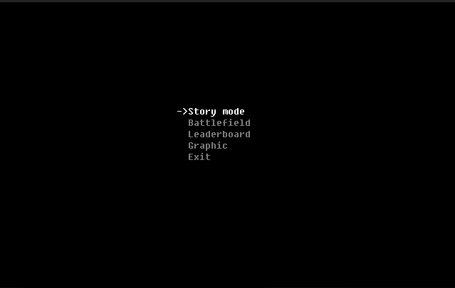
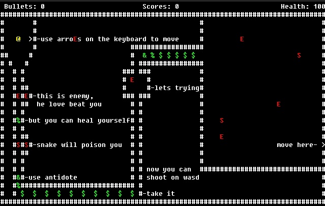
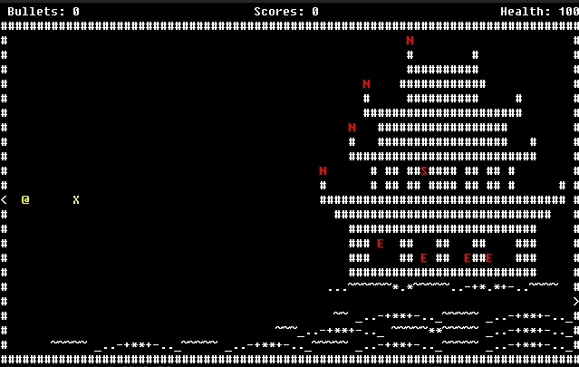
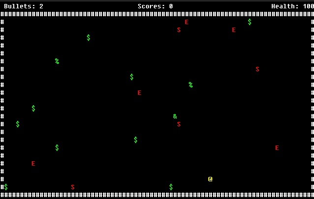

# Game Overview
The game is a real-time Roguelike.

## Game Modes
There are two game modes:
- **Story Mode**: This mode consists of 6 levels that you need to complete to win.
- **Battlefield**: An endless mode where enemies and bonuses continuously appear within the game field. The goal is to accumulate as many points as possible. Points are awarded for killing enemies.

## Enemies
There are three types of enemies:
- **`E` - Regular Enemy**
  - Damage: `50`
  - Movement Speed: medium
  - Pursuit Speed: medium
  - Vision Range: `5`
  - Points for Killing: 100
- **`S` - Snake**
  - Damage: `10`
  - Movement Speed: slow
  - Pursuit Speed: fast
  - Vision Range: `3`
  - Points for Killing: `150`
  - Special Feature: Upon contact with the character, the snake releases poison that slowly reduces the character's health.
- **`N` - Ninja**
  - Damage: `20`
  - Movement Speed: none
  - Pursuit Speed: instantaneous
  - Vision Range: `17`
  - Points for Killing: `80`

## Bonuses
There are four types of bonuses in the game:
- **`$` - Coin**: Picking up a coin allows you to "buy" one bullet to shoot.
- **`%` - Food**: Picking up food restores `50` HP.
- **`&` - Antidote**: The antidote cures the poison left by snakes (`S`).
- **`X` - Chest**: When a chest interacts with the player (`@`) or a bullet (`*`), it is destroyed, leaving behind coins (`$`) and food (`%`).

## Controls
- **W, A, S, D**: Shoot in different directions.
- **←, →, ↑, ↓**: Move the character.

## Setting Up the Development Environment
1. On the official CMake website, find the "Latest Release" section and then the "Unix/Linux Source" line.
2. Download the `cmake-*.tar.gz` archive from the link in this line (where `*` will be the version).
3. Execute the following commands in the terminal:

## Images

